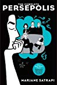
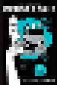

# gatsby-plugin-pixelate [![npm][npm-image]][npm-url]

> A Gatsby plugin for pixelating images

## Install

```bash
npm install gatsby-plugin-pixelate
```

## How to use

```js
// in gatsby-config.js
module.exports = {
  plugins: [
    {
      resolve: "gatsby-plugin-pixelate",
      options: {
        nodeType: "GoodreadsBook",
        nodeInput: "image_url",
        nodeOutput: "image_pixelated",
        ratio: 5
      }
    }
  ]
};
```

It will extend the `nodeType` with the _base64_ version of the image contained in `nodeInput`

```js
  // GoodreadsBook node in GraphQL
  fields {
    image_pixelated
  }
```

## Available options

- `nodeType` the node type where the original image is present.
- `nodeInput` the property defining the original image url.
- `nodeOutput` (default: `image_pixelated`) the property where the _base64_ pixelated version of the image is going to be returned (in `fields` property).
- `ration` the ratio of pixelation, a value from _0_ to _100_.

## Example

_Original:_



_Pixelated:_



## Note

The image manipulation is powered by [Jimp](https://www.npmjs.com/package/jimp).

If you need multiple images just add a multiple config.

```js
  {
    resolve: "gatsby-plugin-pixelate",
      options: {
        nodeType: "GoodreadsBook",
        nodeInput: "image_url",
        nodeOutput: "image_pixelated",
        ratio: 5
      }
    }
  },
  {
    resolve: "gatsby-plugin-pixelate",
      options: {
        nodeType: "GoodreadsAuthor",
        nodeInput: "image_url",
        ratio: 5
      }
    }
  }
```

[npm-image]: https://img.shields.io/npm/v/gatsby-plugin-pixelate.svg
[npm-url]: https://npmjs.com/package/gatsby-plugin-pixelate
